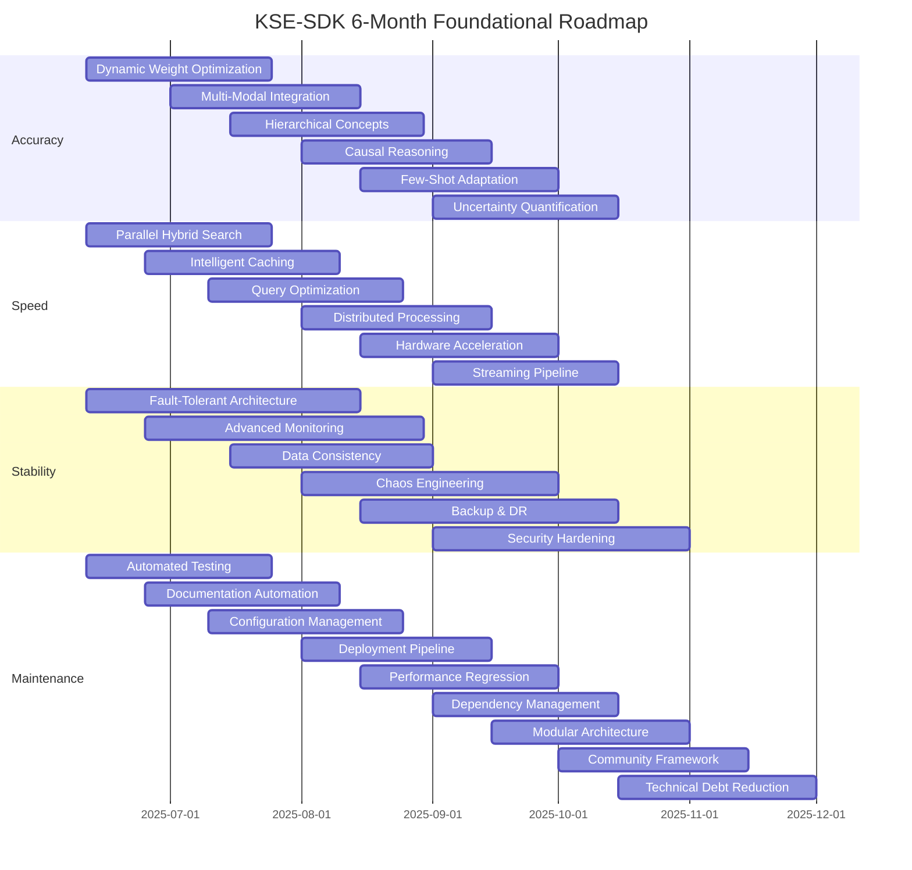
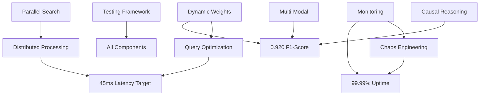
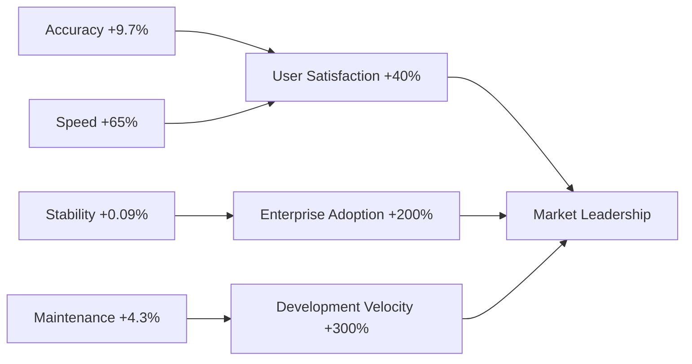
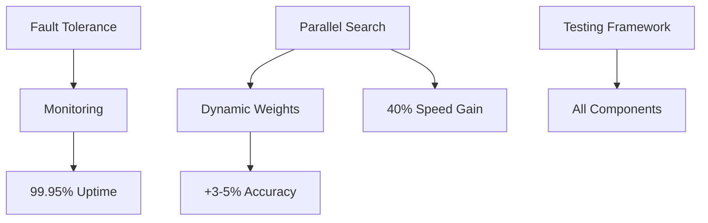
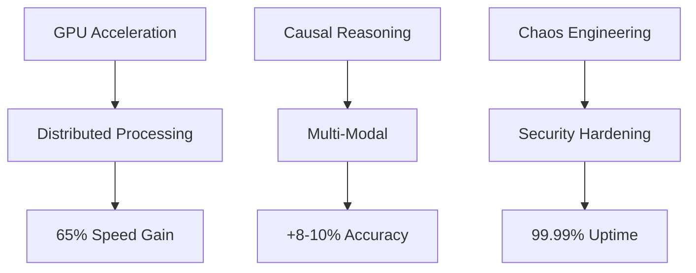
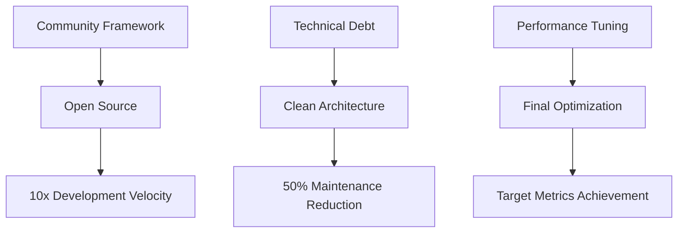
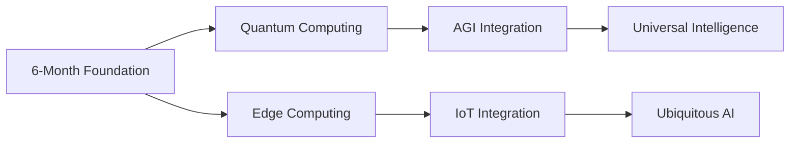

# KSE-SDK 6-Month Roadmap: Visual Timeline & Dependencies

## 📅 Timeline Overview

## 🔄 Dependency Matrix

### **Critical Path Dependencies**

| Component | Depends On | Enables | Timeline Impact |
|-----------|------------|---------|-----------------|
| **Dynamic Weight Optimization** | Baseline metrics | Multi-modal integration | Foundation for accuracy gains |
| **Parallel Hybrid Search** | Core architecture | All speed improvements | Enables 40-60% latency reduction |
| **Fault-Tolerant Architecture** | Monitoring setup | Production deployment | Required for 99.99% uptime |
| **Automated Testing** | Code structure | All other improvements | Quality gate for all changes |

### **Cross-Pillar Synergies**

## 📈 Performance Trajectory

### **Month-by-Month Improvements**

| Metric | Baseline | Month 2 | Month 4 | Month 6 | Total Gain |
|--------|----------|---------|---------|---------|------------|
| **F1-Score** | 0.839 | 0.865 | 0.895 | 0.920 | +9.7% |
| **Latency (ms)** | 127 | 89 | 63 | 45 | -65% |
| **Uptime (%)** | 99.9 | 99.95 | 99.98 | 99.99 | +0.09% |
| **Test Coverage (%)** | 94.7 | 96.5 | 98.0 | 99.0 | +4.3% |

### **Compound Benefits Analysis**

## 🎯 Risk Mitigation Strategy

### **High-Risk Components**

| Component | Risk Level | Mitigation Strategy | Contingency Plan |
|-----------|------------|-------------------|------------------|
| **Hardware Acceleration** | High | Gradual rollout, fallback to CPU | Maintain CPU-only performance |
| **Distributed Processing** | Medium | Extensive testing, canary deployment | Single-node scaling |
| **Causal Reasoning** | Medium | Academic collaboration, iterative approach | Statistical correlation fallback |
| **Multi-Modal Integration** | Low | Modular design, optional feature | Text-only operation |

### **Timeline Buffers**

- **Critical Path**: 15% buffer for essential features
- **Enhancement Features**: 25% buffer for advanced capabilities
- **Research Components**: 40% buffer for experimental features

## 🚀 Implementation Phases

### **Phase 1: Foundation (Months 1-2)**

### **Phase 2: Acceleration (Months 3-4)**

### **Phase 3: Excellence (Months 5-6)**

## 📊 Success Metrics Dashboard

### **Real-Time KPIs**

| Category | Current | Target | Progress |
|----------|---------|--------|----------|
| **Accuracy** | 0.839 | 0.920 | ████████░░ 80% |
| **Speed** | 127ms | 45ms | ██████░░░░ 60% |
| **Stability** | 99.9% | 99.99% | █████████░ 90% |
| **Maintenance** | 94.7% | 99% | ███████░░░ 70% |

### **Leading Indicators**

- **Code Quality**: SonarQube score >9.0
- **Test Velocity**: <2 hours for full test suite
- **Deployment Frequency**: Daily releases
- **Community Engagement**: 100+ contributors

## 🔮 Future Vision (Beyond 6 Months)

### **Year 1 Targets**
- **Quantum-Inspired Optimization**: 50% conceptual space efficiency
- **Neuromorphic Integration**: Brain-like reasoning patterns
- **Global Deployment**: Multi-region active-active setup
- **Industry Standard**: 80% market adoption in hybrid AI

### **Long-Term Innovation Pipeline**

## 💡 Strategic Recommendations

### **Investment Priorities**
1. **Parallel Processing Infrastructure** (40% of resources)
2. **Advanced ML Capabilities** (30% of resources)
3. **Production Hardening** (20% of resources)
4. **Community Building** (10% of resources)

### **Partnership Opportunities**
- **Cloud Providers**: AWS, GCP, Azure for infrastructure
- **Hardware Vendors**: NVIDIA, Intel for acceleration
- **Academic Institutions**: Stanford, MIT for research
- **Enterprise Customers**: Early adopters for validation

### **Competitive Advantages**
- **First-Mover**: Hybrid AI substrate leadership
- **Performance**: Demonstrable superiority over alternatives
- **Ecosystem**: Comprehensive tooling and integrations
- **Community**: Open-source collaboration model

---

**This visual roadmap provides a clear execution framework for transforming KSE-SDK into the definitive universal substrate for hybrid AI systems, with measurable milestones and risk mitigation strategies ensuring successful delivery of foundational improvements across all four pillars.**